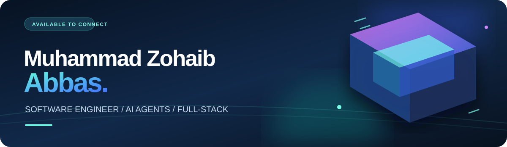
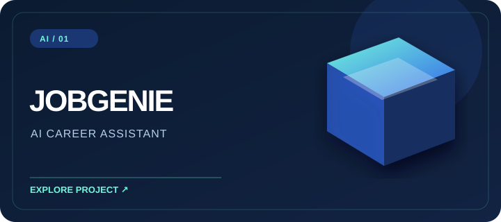
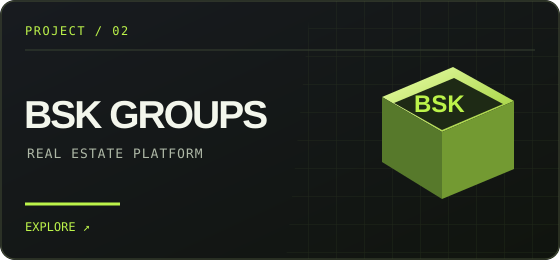
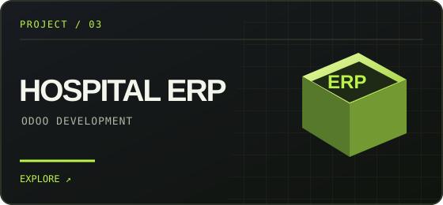

<div align="center">



<br/><br/>

<a href="https://zohaib-57.github.io/New_PortFolio/"></a>
<a href="https://www.linkedin.com/in/muhammad-zohaib-abbas57/"></a>
<a href="mailto:zohaibabbas8557@gmail.com"></a>

</div>

<br/>

## 01 / ABOUT

**I'm Zohaib.** I build AI-enabled software, full-stack web products, and practical business systems. I work as an **Odoo Technical Developer at NerithonX Technologies**, developing modules and workflows for a hospital management system.

I graduated in Software Engineering from **Islamia College Peshawar** with a **3.68/4.00 CGPA**. Right now, I'm learning to build **AI agents with Node.js and JavaScript**: tool calling, multi-step orchestration, memory, and evaluation.

```js
const focus = ["AI agents", "full-stack web", "Odoo ERP"];
const location = "Peshawar, Pakistan";
```

## 02 / SELECTED WORK

<table><tr><td width="50%" valign="top"><br/><b>JobGenie · AI career assistant</b><br/>My two-person final-year project. I developed the backend and AI integrations for résumé analysis, ATS scoring, résumé generation, recommendations, and job matching.<br/><sub>Node.js · Express · MongoDB · Gemini / OpenAI</sub></td><td width="50%" valign="top"><a href="https://github.com/Zohaib-57/BSK-GROUPS"></a><br/><b>BSK Groups · Property platform</b><br/>A real estate web product for exploring property listings.<br/><a href="https://github.com/Zohaib-57/BSK-GROUPS">View code ↗</a> · <a href="https://bsk-groups.vercel.app/">Visit site ↗</a></td></tr><tr><td width="50%" valign="top"><a href="https://github.com/Zohaib-57/hospital_management"></a><br/><b>Hospital Management · Odoo ERP</b><br/>Custom modules with models, views, access rules, business workflows, computed fields, and QWeb reports.<br/><a href="https://github.com/Zohaib-57/hospital_management">View repository ↗</a></td><td width="50%" valign="top"><br/><b>More things I've built</b><br/><br/>↗ <a href="https://github.com/Zohaib-57/Google-Drive-Clone">Google Drive Clone</a> — file storage with Supabase.<br/><br/>↗ <a href="https://github.com/Zohaib-57/Coffee_shop_Project">Coffee Shop</a> — responsive frontend · <a href="https://zohaib-57.github.io/Coffee_shop_Project/">live demo</a>.<br/><br/>↗ <a href="https://github.com/Zohaib-57/AI_ML_NLP">AI / ML / NLP</a> — learning and experiments.</td></tr></table>

## 03 / THE TOOLKIT

<div align="center">

    

    

**Also working with:** OpenAI API · Gemini API · LangChain · LangGraph · RAG · REST APIs · QWeb

</div>

## 04 / GITHUB PULSE

<div align="center">

<a href="https://github.com/Zohaib-57?tab=repositories"></a>
<a href="https://github.com/Zohaib-57?tab=followers"></a>

<br/><br/>


<sub>Repository count checked September 2026. Streak and followers update dynamically.</sub>

</div>

---

<div align="center">

### HAVE AN IDEA? LET'S BUILD IT.

[Email me](mailto:zohaibabbas8557@gmail.com) · [LinkedIn](https://www.linkedin.com/in/muhammad-zohaib-abbas57/) · [Portfolio](https://port-folio-2-0-seven.vercel.app/)

</div>
